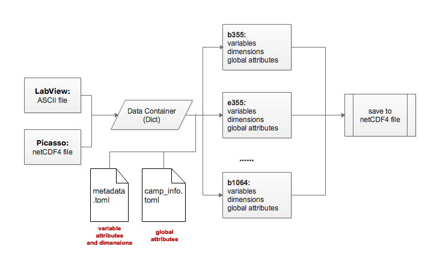

# Introduction to polly2scc

`polly2scc` is a specified Python package to facilitate the conversion of Polly processed profiles to [EARLINET data format](EARLINET_new_data_format_specification.md).

## Program structure

 
<b>program structure</b>

## Example files

**LabView file**

LabView output consists of data file and info file. They are both ASCII files and the latter contains the retrieving configurations, which is required by the EARLINET data format.

- data/dushanbe-20150803_1800-2159-99smooth.txt
- data/dushanbe-20150803_1800-2159-99smooth-info.txt
- data/le_arielle-20190723_2100-0058-49smooth.txt
- data/le_arielle-20190723_2100-0058-49smooth-info.txt

**Picasso file**

Picasso profile is netCDF4 format.

- data/2020_04_09_Thu_TROPOS_00_00_01_0000_0059_profiles.nc

**EARLINET exemplified files**

- data/pid291_pot1207092259.b355.nc
- data/pid293_pot1207092259.b1064.nc
- data/pid470_pot1207092259.e355.nc
- data/pid471_pot1207092259.e532.nc
- data/pid691_pot1207092259.b532.nc